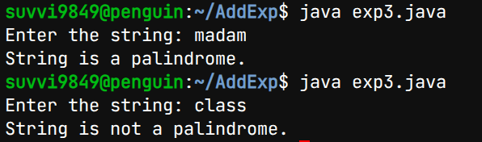
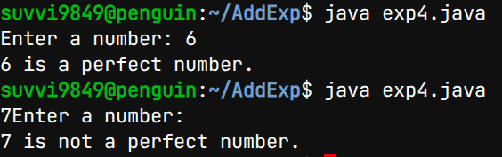

# Add Experiments-2
## Title:Find the sum of first Fibonacci Numbers
## Source code:
``` java
class Fibonacci {
    int a=0,b=1,c,n;
    int sum=0;
    Fibonacci(int n) {
        this.n=n;
    }
    void printFib() {
        for(int i=1;i<=n;i++) {
            if (i==1)
                c=a;
            else if (i==2)
                c=b;
            else {
                c=a+b;
                a=b;
                b=c;
            }
            sum+=c;
            if (i==n)
                System.out.print(c + ".");
            else
                System.out.print(c + ",");
      }
    }
    int getSum(){
        return sum;
    }
  }
import java.util.Scanner;
class Main {
    public static void main(String[] args) {
        Scanner sc = new Scanner(System.in);
        System.out.print("\nenter no.of Fibonacis terms:");
        int n = sc.nextInt();
        if(n>0){
        Fibonacci f = new Fibonacci(n);
        System.out.println("Fibnacci series are:");
        f.printFib();
        System.out.println("\nThe sum of Fibonacis series: " + f.getSum());
        }
        else{
            System.out.println("Fibonacci sequence and sum can not be calculated");
        }
   }
}
```
## Output:


# Add Experiments-1
## Title:Java program to insert a given string into main string
## Source code:
``` java
import java.util.Scanner;

class SubStringInsert {
    public static void main(String[] args) {

        String mainString, subString;
        int position;

        Scanner sc = new Scanner(System.in);

        System.out.print("Enter the main string: ");
        mainString = sc.nextLine();

        System.out.print("Enter the sub string: ");
        subString = sc.nextLine();

        System.out.print("Enter the position: ");
        position = sc.nextInt();

        int length = mainString.length();
        String resultString;

            if (position >= 0 && position <= length) {

            String firstPart = mainString.substring(0, position);
            String secondPart = mainString.substring(position);

            resultString = firstPart + subString + secondPart;

            System.out.println("Resultant String = " + resultString);
        } 
        else {
            System.out.println("Substring is not possible to insert");
            System.out.println("Condition: 0 <= position <= length of main string");
        }

        sc.close();
    }
}

```
## Output:


# Add Experiments-3
## Title:Java program to find given string is palindrome or not
## Source code:
``` java
import java.util.Scanner;

class Palindrome {
    public static void main(String[] args) {

        String str;
        Scanner sc = new Scanner(System.in);

        System.out.print("Enter the string: ");
        str = sc.nextLine();

        int start = 0;
        int end = str.length() - 1;
        boolean flag = true;

          while (start < end) {
            if (str.charAt(start) != str.charAt(end)) {
                System.out.println("String is not a palindrome.");
                flag = false;
                break;
            }
            start++;
            end--;
        }

        if (flag) {
            System.out.println("String is a palindrome.");
        }

        sc.close();
    }
}
```
## Output:


# Add Experiments-4
## Title:Java program to check given number is perfect number or not
## Source code:
``` java
import java.util.Scanner;
public class PerfectNumber {
    public static void main(String[] args) {
        int num, sum = 0;
        Scanner sc = new Scanner(System.in);
        System.out.print("Enter a number: ");
        num = sc.nextInt();

        for (int i = 1; i < num; i++) {
            if (num % i == 0) {
                sum = sum + i;
            }
        }

          if (sum == num) {
            System.out.println(num + " is a perfect number.");
        } else {
            System.out.println(num + " is not a perfect number.");
        }

        sc.close();
    }
}

```
## Output:



