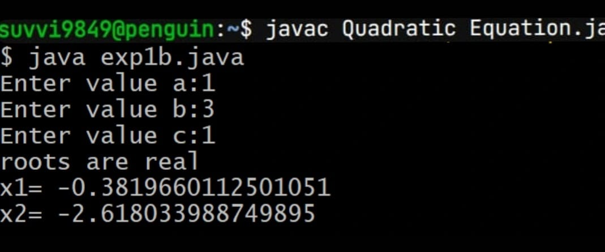
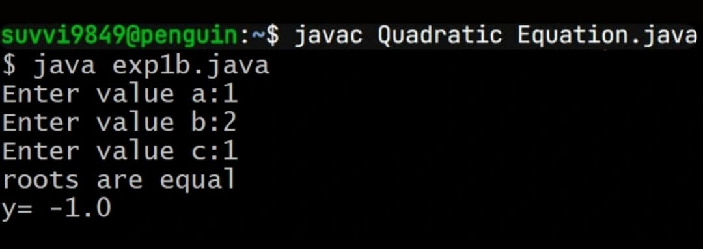

# Experiment-1
## 1a) Displaying Default Primitive Data Type
## Source code
``` java
class DefaultPrimitiveValues {
    static byte b;
    static short s;
    static int i;
    static long l;
    static float f;
    static double d;
    static char c;
    static boolean bool;

    public static void main(String[] args) {
        System.out.println("Default values of Java primitive types:\n");
        System.out.println("byte    : " + b);
        System.out.println("short   : " + s);
        System.out.println("int     : " + i);
        System.out.println("long    : " + l);
        System.out.println("float   : " + f);
        System.out.println("double  : " + d);
        System.out.println("char    : '" + c + "'");
        System.out.println("boolean : " + bool);
    }
}
```
## output:

# Experiment-1b
## 1b)Calculate the roots of Quadratic Equation
## Source code:
``` java
import java.util.Scanner;

public class QuadraticEquation {
    public static void main(String[] args) {

        Scanner sc = new Scanner(System.in);

        System.out.print("Enter a: ");
        double a = sc.nextDouble();

        System.out.print("Enter b: ");
        double b = sc.nextDouble();

        System.out.print("Enter c: ");
        double c = sc.nextDouble();

        double D = b * b - 4 * a * c;

        // Case 1: Two distinct real roots
        if (D > 0) {
            double root1 = (-b + Math.sqrt(D)) / (2 * a);
            double root2 = (-b - Math.sqrt(D)) / (2 * a);

            System.out.println("Two distinct real roots:");
            System.out.println("Root 1 = " + root1);
            System.out.println("Root 2 = " + root2);
        }

        else if (D == 0) {
            double root = -b / (2 * a);

            System.out.println("One real root:");
            System.out.println("Root = " + root);
        }

        else {
            double realPart = -b / (2 * a);
            double imaginaryPart = Math.sqrt(-D) / (2 * a);

            System.out.println("Two complex roots:");
            System.out.println("Root 1 = " + realPart + " + " + imaginaryPart + "i");
            System.out.println("Root 2 = " + realPart + " - " + imaginaryPart + "i");
        }

        sc.close();
    }
}
```
## Output:
## Case1:(D>0)




