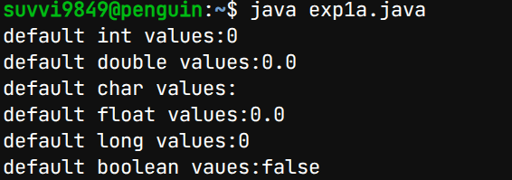

# Experiment-1
## 1a) Displaying Default Primitive Data Type
## Source code
``` java
class DefaultPrimitiveValues {

    // primitive data types
    static byte b;
    static short s;
    static int i;
    static long l;
    static float f;
    static double d;
    static char c;
    static boolean bool;

    public static void main(String[] args) {
        System.out.println("Default values of Java primitive types:\n");

        System.out.println("byte    : " + b);
        System.out.println("short   : " + s);
        System.out.println("int     : " + i);
        System.out.println("long    : " + l);
        System.out.println("float   : " + f);
        System.out.println("double  : " + d);
        System.out.println("char    : '" + c + "'");
        System.out.println("boolean : " + bool);
    }
}
```
## output:


