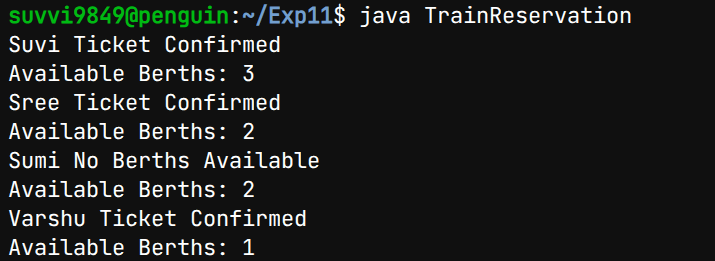

## Experiment-8a
## Title:Train Reservation System
## SourceCode:
``` java
class Reservation {
    int availableBerths;

    Reservation(int berths) {
        availableBerths = berths;
    }

    synchronized void reserve(String name, int berthsNeeded) {
        if (berthsNeeded <= availableBerths) {
            System.out.println(name + " Ticket Confirmed");
            availableBerths -= berthsNeeded;
            System.out.println("Available Berths: " + availableBerths);
        } else {
            System.out.println(name + " No Berths Available");
            System.out.println("Available Berths: " + availableBerths);
        }
    }
}

class Person extends Thread {
    Reservation r;
    String personName;
    int berthsNeeded;

    Person(Reservation r, String name, int berths) {
        this.r = r;
        this.personName = name;
        this.berthsNeeded = berths;
    }

    public void run() {
        r.reserve(personName, berthsNeeded);
    }
}

class TrainReservation {
    public static void main(String[] args) {

        Reservation r = new Reservation(5);

        Person p1 = new Person(r, "Suvi", 2);
        Person p2 = new Person(r, "Varshu", 1);
        Person p3 = new Person(r, "Sumi", 3);
        Person p4 = new Person(r, "Sree", 1);

        p1.start();
        p2.start();
        p3.start();
        p4.start();
    }
}
```
## Output:

