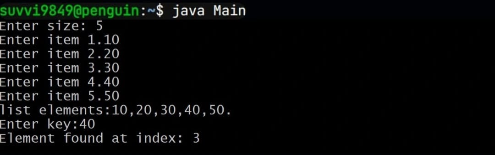

# Experiment-3
## 3a) Title: Implement constructor overloading 
## Source Code:
``` java
class Student {

    String name;
    int age;
    double marks;

    Student() {
    }
    Student(String name, int age, double marks) {
        this.name = name;
        this.age = age;
        this.marks = marks;
    }
    void display() {
        System.out.println("Name : " + name);
        System.out.println("Age : " + age);
        System.out.println("Marks : " + marks);
    }
}

class Main {

    public static void main(String args[]) {

        Student std = new Student();
        std.display();

        Student std1 = new Student("Suvi", 18, 97.8);
        std1.display();
    }
}
```
## Output:

## 3b) Title: Binary search mechanism
## Source Code:
``` java
import java.util.Scanner;

class BinarySearch {

    int list[];
    int size;

    BinarySearch(int size) {
        list = new int[size];
        this.size = size;
    }
    void setList() {
        Scanner sc = new Scanner(System.in);
        System.out.println("Enter the list of items in ascending order:");
        for (int i = 0; i < size; i++) {
            list[i] = sc.nextInt();
        }
    }

    void getList() {
        for (int i = 0; i < size; i++) {
            System.out.print(list[i] + " ");
        }
        System.out.println();
    }

    int binarySearch(int key) {
        int low = 0;
        int high = list.length - 1;
        int mid;
        while (low <= high) {
            mid = (low + high) / 2;
            if (list[mid] == key) {
                return mid + 1;
            } else if (list[mid] < key) {
                low = mid + 1;
            } else {
                high = mid - 1;
            }
        }
        return -1;
    }
}

class Main {

    public static void main(String args[]) {

        Scanner sc = new Scanner(System.in);
        System.out.print("Enter size of array: ");
        int n = sc.nextInt();
        BinarySearch bs = new BinarySearch(n);
        bs.setList();
        System.out.print("Elements are: ");
        bs.getList();
        System.out.print("Enter element to search: ");
        int key = sc.nextInt();
        int index = bs.binarySearch(key);
        if (index == -1) {
            System.out.println("Element " + key + " not found in the list");
        } else {
            System.out.println("Element " + key + " found at position " + index);
        }
    }
}

```
## Output:

