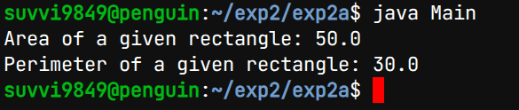
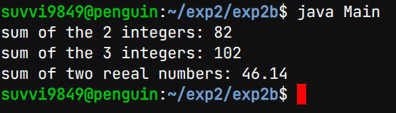

# Experiment-2
## 2a) Title:Create a class, method and invoke them inside main method
## Source Code:
``` java
class Rectangle{
    double length;
    double breadth;
  double area(){
    return length*breadth;
  }
  double perimeter(){
    return 2*(length+breadth);
    }
  }

class Main{
    public static void main(String[] args){
	Rectangle rect = new Rectangle();
	rect.length = 10;
	rect.breadth = 5;
	double area = rect.area();
	double perimeter = rect.perimeter();
	System.out.println("Area of a given rectangle: " +area);
	System.out.println("Perimeter of a given rectangle: " +perimeter);
    }
  }
```
## Output:

## 2b) Title: Implement method overloading
## Source Code:
``` java
class Main{
    public static void main(String[] args){
	Rectangle rect = new Rectangle();
	rect.length = 10;
	rect.breadth = 5;
	double area = rect.area();
	double perimeter = rect.perimeter();
	System.out.println("Area of a given rectangle: " +area);
	System.out.println("Perimeter of a given rectangle: " +perimeter);
    }
  }
 class Main{
    public static void main(String[] args){
      Sum S = new Sum();
      System.out.println("sum of the 2 integers: " +S.Sum(36,46));
      System.out.println("sum of the 3 integers: " +S.Sum(20,36,46));
      System.out.println("sum of two reeal numbers: " +S.Sum(30.465,15.675));
    }
  }
```
## Output:


